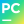

<h1 align="center">Hi there, I'm VV! 👋</h1>
<h3 align="center">Software Engineering Student | Backend & DevOps Enthusiast</h3>

- 🌱 I’m currently learning **C**
- 👀 I’m interested in ML, Backend, DevOps

### Languages

### Technologies

### Tools

<!---
vv-meow-meow/vv-meow-meow is a ✨ special ✨ repository because its `README.md` (this file) appears on your GitHub profile.
You can click the Preview link to take a look at your changes.
--->

<!---
Used sites:
- Simple icons – https://simpleicons.org/
- Markdown Badges – https://ileriayo.github.io/markdown-badges/
--->