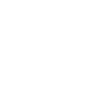

<h1 align="center">Hi there, I'm VV! 👋</h1>
<h3 align="center">Software Engineering Student | Backend, ML & DevOps Explorer</h3>

- 🌱 Currently learning: **C** at
  <a href="https://21-school.ru/">School 21 </a>
- 👀 Interested in: Backend, ML, and DevOps
- 📇 I’m currently working on a subscription-based service that combines my passion for backend development and DevOps.

### My SaaS Project

- **Service with 700+ users**
- Built using PostgreSQL, Docker, and Telegram bots with **AIOgram**, **SQLAlchemy**,
  and **[Project Fluent](https://projectfluent.org/)** for internationalization.
- Managed configurations through `.env` and `.yml` files for flexible and efficient environment setup.
- Security and isolation via Docker Network for the database, with seamless updates managed through GitLab.

### Languages

  
  

  
  
  

### Technologies

  
  
  

<!---
vv-meow-meow/vv-meow-meow is a ✨ special ✨ repository because its `README.md` (this file) appears on your GitHub profile.
You can click the Preview link to take a look at your changes.
--->

<!---
Used sites:
- Simple icons – https://simpleicons.org/
- Markdown Badges – https://ileriayo.github.io/markdown-badges/
- Habr – https://habr.com/ru/articles/649363/

Useful code:

--->
